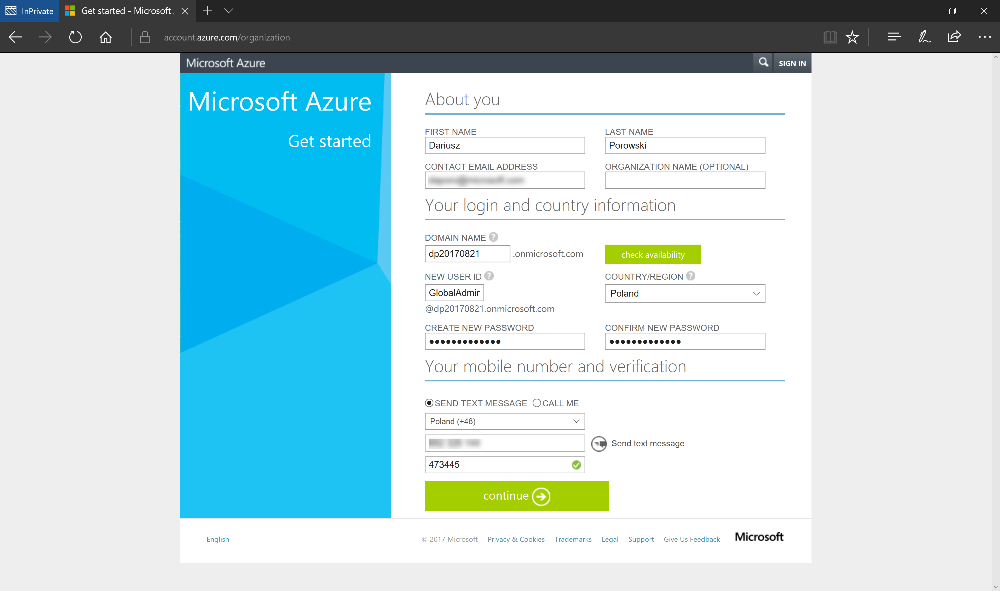
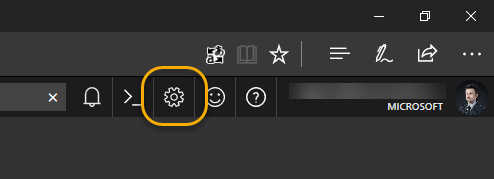
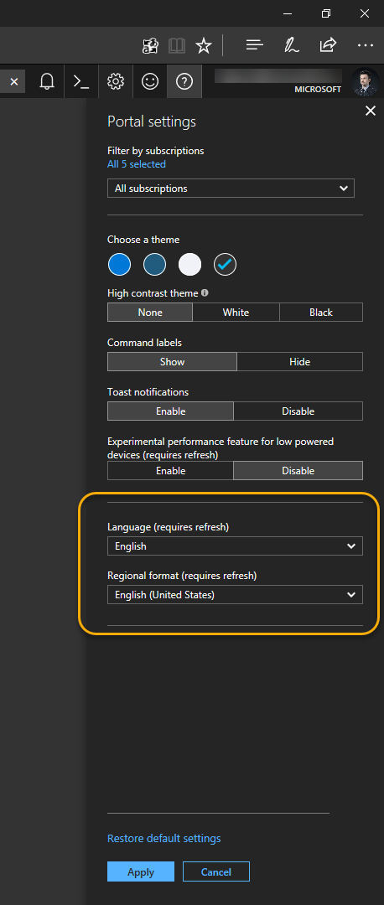

# Prepare Microsoft Azure Subscription and tools

## Exercises
This lab includes the following exercises:
- [Prepare Microsoft Azure Subscription and tools](#prepare-microsoft-azure-subscription-and-tools)
  - [Exercises](#exercises)
    - [Exercise 1: Create a new Azure Active Directory tenant](#exercise-1-create-a-new-azure-active-directory-tenant)
    - [Exercise 2A (Option 1): Activate a Microsoft Azure Pass subscription](#exercise-2a-option-1-activate-a-microsoft-azure-pass-subscription)
    - [Exercise 2B (Option 2): Activate a free Microsoft Azure Trial subscription](#exercise-2b-option-2-activate-a-free-microsoft-azure-trial-subscription)
    - [Exercise 3: Set language and regional settings for Azure Portal](#exercise-3-set-language-and-regional-settings-for-azure-portal)
    - [Exercise 4: Install CLIs](#exercise-4-install-clis)


### Exercise 1: Create a new Azure Active Directory tenant
1. Open a browser in **InPrivate** session, and navigate to [https://account.azure.com/organization](https://account.azure.com/organization)
2. Fill the form with your data (make sure a contact e-mail address, and a mobile number are not fake). Moreover, a domain name needs to be unique globally (for training purpose, you can use a pattern like **\<your initials\>\<today's date in YYYYMMDD format\>.onmicrosoft.com**, e.g., **jd20170821.onmicrosoft.com**). For user ID you can use, e.g., **GlobalAdmin**, then your Work account full name will be **GlobalAdmin@jd20170821.onmicrosoft.com**



_New Azure Active Directory tenant form_

3. Click **Continue**, and after your new Azure AD will be created, close the browser.

[Scroll to Top](#exercises)

### Exercise 2A (Option 1): Activate a Microsoft Azure Pass subscription
1. Ask the Trainer for an activation code.
2. Open a browser in **InPrivate** session, and navigate to [https://www.microsoftazurepass.com/Home/HowTo](https://www.microsoftazurepass.com/Home/HowTo)
3. On **How To** page you will find all necessary information how to activate a new Microsoft Azure Pass subscription. For "Sign In" use your new Work account, created in previous step, e.g., **GlobalAdmin@jd20170821.onmicrosoft.com**


_Sign in form_

4. After successful Microsoft Azure subscription activation close the browser.

[Scroll to Top](#exercises)

### Exercise 2B (Option 2): Activate a free Microsoft Azure Trial subscription
1. Open a browser in **InPrivate** session, and navigate to [https://azure.microsoft.com/en-us/free/](https://azure.microsoft.com/en-us/free)
2. Click on **Start free** button.


_Microsoft Azure Trial subscription page_

3. Sign In use your new Work account, created in previous step, e.g., **GlobalAdmin@jd20170821.onmicrosoft.com**


_Sign in form_

4. On **Free trial sign up** page fill the form with your data (make sure a contact e-mail address, and a mobile number are not fake). In this case, you need to provide valid credit card information to verify your identity. At the end click **Sign up** button.


_Free trial sign up page_

5. Wait a few minutes until you see a page with the **Get started with your Azure subscription** button.


_Ready trial account page_

6. Close the browser.

[Scroll to Top](#exercises)

### Exercise 3: Set language and regional settings for Azure Portal
1. Open a browser in **InPrivate** session, and navigate to [https://portal.azure.com](https://portal.azure.com)
2. On a top-right corner, click on the **Setting** button (gear icon).



_Settings Gear_

3. Scroll to the bottom and set **English** for **Language**, and **English (United States)** for the **Regional format**, then click **Apply**.



_Language and Regional format settings_

4. Close the browser.

### Exercise 4: Install CLIs

Steps here are optional, because you can always use Azure Cloud Shell directly from [https://portal.azure.com](https://portal.azure.com). For those of you who would like to use kubernetes tools in the future we recommend installing tools localy. 

1. Install `az CLI` on your desktop. Detailed instructions for various operating systems can be found [here](https://docs.microsoft.com/en-us/cli/azure/install-azure-cli?view=azure-cli-latest)

2. Install `kubectl` on your desktop using command below. Remember to properly set PATH env - follow instructions in your conssole.

```shell
az aks install-cli
```

~~3. For Windows install `chocolatey` package manager from [here](https://chocolatey.org/install).~~
   
~~4. Install `helm client` using following [instruction](https://helm.sh/docs/using_helm/#installing-the-helm-client).~~


5. Login to `az CLI` using account you created.
   
```shell
az login --use-device-code
az account set --subscription <ID-of-your-Azure-subscription>
```
