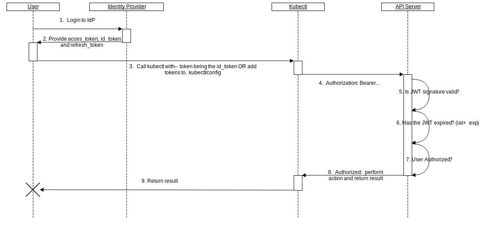
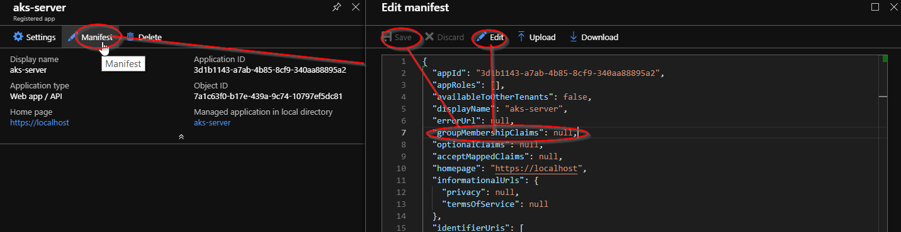

# 1. Deploy an Azure Kubernetes Service (AKS) cluster with AAD integration

## Authentication in Kubernetes

All Kubernetes clusters have two categories of users: `service` accounts managed by Kubernetes, and normal `users`.

Normal users are assumed to be managed by an outside, independent service. An admin distributing private keys, a user store like Keystone or Google Accounts, even a file with a list of usernames and passwords. In this regard, Kubernetes does not have objects which represent normal user accounts. Normal users cannot be added to a cluster through an API call.

In contrast, service accounts are users managed by the Kubernetes API. They are bound to specific namespaces, and created automatically by the API server or manually through API calls. Service accounts are tied to a set of credentials stored as `Secrets`, which are mounted into pods allowing in-cluster processes to talk to the Kubernetes API.

API requests are tied to either a normal user or a service account, or are treated as anonymous requests. This means every process inside or outside the cluster, from a human user typing kubectl on a workstation, to kubelets on nodes, to members of the control plane, must authenticate when making requests to the API server, or be treated as an anonymous user.

## AKS integration with Azure AD

OpenID Connect is a flavor of OAuth2 supported by some OAuth2 providers, notably Azure Active Directory. The protocol’s main extension of OAuth2 is an additional field returned with the access token called an ID Token. This token is a JSON Web Token (JWT) with well known fields, such as a user’s email, signed by the server and issuer information.



Azure AD is integrated with AKS trough [webhook token authentication](https://kubernetes.io/docs/reference/access-authn-authz/authentication/#webhook-token-authentication) and performs authentication using id_tokens. Additionally, cluster administrators are able to configure Kubernetes role-based access control (RBAC) based on a users identity or directory group membership.

## AAD integration details

### 1. Create AAD Server application 

This `confidential client` will be used by AKS to download user group membership.

1.1. Navigate to Azure Active Directory > App registrations > New application registration.

1.2. Create application of type `Web app / API` with name of your choice and any valid URL. 

1.3. In the manifest of created application set `"groupMembershipClaims"` to `"All"` - this will tell application to include group membership information of user in issued tokens.



1.4. Set following permissions in the application for `Microsoft Graph` API:
- `Read directory data` in Application Permissions
- `Sign in and read user profile` in Delegated Permissions
- `Read directory data` in Delegated Permissions

Do not forget to "Grant permissions".

1.5. Save ApplicationID and generate/save Key for your application - they will be needed to deploy your AAD-enabled cluster.

Alternatively you can crate Application using following commands. Note following [issue](https://github.com/Azure/azure-cli/issues/7283)


### 2. Create AAD client authentication

This `public client` will be used to authenticate users in kubectl.


2.1. Navigate to Azure Active Directory > App registrations > New application registration.

2.2. Create application of type `Native` with name of your choice and any valid URL.

2.3. Set following permissions in the application for your "Server" API and press "Grant permissions".

2.4. Save ApplicationID of your application

### 3. Deploy AAD-Enabled AKS cluster

3.1 Create resource group for AKS.

``` shell
az group create --name <my-resource-group-name> --location westeurope
```
3.2 Deploy cluster

``` shell
az aks create \
  --resource-group <my-resource-group-name> \
  --name <my-cluster-name> \
  --generate-ssh-keys \
  --node-count 3 \
  --kubernetes-version 1.12.5 \
  --node-vm-size Standard_DS2_v2 \
  --aad-server-app-id <server-app-id> \
  --aad-server-app-secret <server-app-secret> \
  --aad-client-app-id <client-app-id> \
  --aad-tenant-id <tenant-id>
```

3.3 Download cluster admin credentials from AKS. Note --admin switch to bypass AAD authentication.

```shell
az aks get-credentials --resource-group <my-resource-group-name> --name <my-cluster-name>  --admin

kubectl config current-context
```

3.4 Grant Kubernetes admin permission to your AAD user.

```shell
kubectl apply -f add-admin.yaml
```
```yaml
apiVersion: rbac.authorization.k8s.io/v1
kind: ClusterRoleBinding
metadata:
  name: my-cluster-admins
roleRef:
  apiGroup: rbac.authorization.k8s.io
  kind: ClusterRole
  name: cluster-admin
subjects:
- apiGroup: rbac.authorization.k8s.io
  kind: User
  name: "<your-login@your.domain>"
```

3.5 Login to your cluster with AAD.

Get cluster credentials

```shell
az aks get-credentials --resource-group <my-resource-group-name> --name <my-cluster-name>
```

Test your access. Note you will be asked to perform device login. 

```shell
kubectl get pods --all-namespaces
```