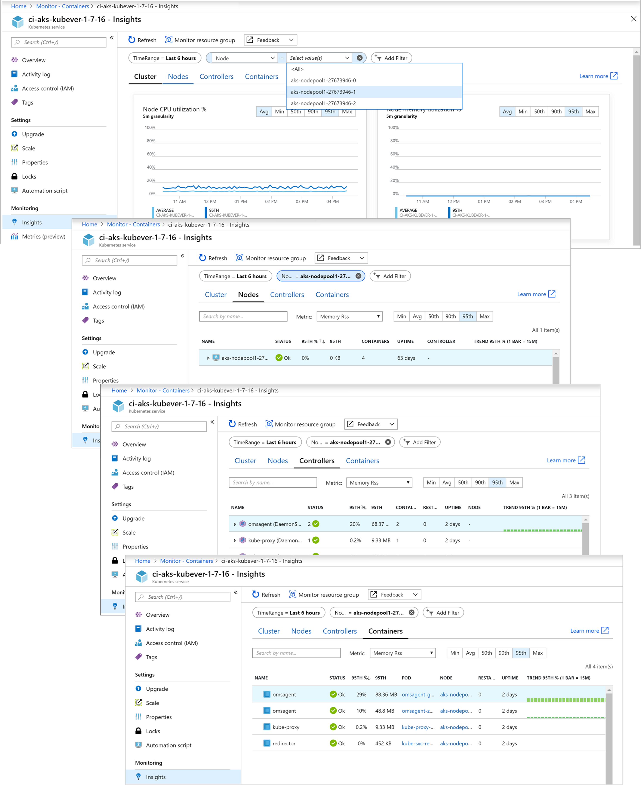
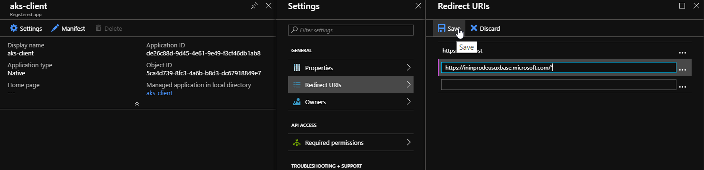
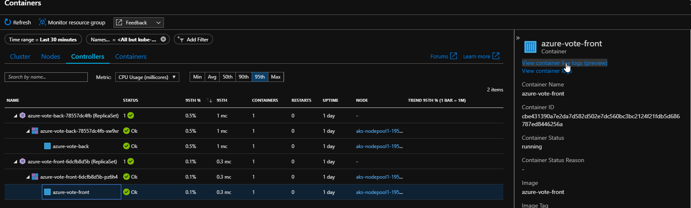

# 3. Implement monitoring and logging in AKS

`Azure Monitor` for containers is a feature designed to monitor the performance of container workloads deployed to either Azure Container Instances or managed Kubernetes clusters hosted on Azure Kubernetes Service (AKS). Monitoring your containers is critical, especially when you're running a production cluster, at scale, with multiple applications.

Azure Monitor for containers includes several pre-defined views that show the residing container workloads and what affects the performance health of the monitored Kubernetes cluster so that you can:
- Identify AKS containers that are running on the node and their average processor and memory utilization. This knowledge can help you identify resource bottlenecks.
- Identify processor and memory utilization of container groups and their containers hosted in Azure Container Instances. 
- Identify where the container resides in a controller or a pod. This knowledge can help you view the controller's or pod's overall performance.
- Review the resource utilization of workloads running on the host that are unrelated to the standard processes that support the pod.
- Understand the behavior of the cluster under average and heaviest loads. This knowledge can help you identify capacity needs and determine the maximum load that the cluster can sustain.

## Deploy Container Monitoring Solution and Log Analytics Workspace

1. Login to portal.azure.com and create new resource of type "Container Monitoring Solution" or use following link: https://portal.azure.com/#create/Microsoft.ContainersOMS.
   
 

2. Get `resource id` of created Log Analytics workspace. You can grab it from portal URL when browsing resource. It shoud have following format:
   
```
/subscriptions/<subscription-id>/resourcegroups/<rg-name>/providers/Microsoft.OperationalInsights/workspaces/<workspace-name>
```

## Install Monitoring addon to AKS cluster

1. For existing cluster run following command

```shell
az aks enable-addons -a monitoring -n <name-of-your-cluster> -g <resource-group-name> --workspace-resource-id <ExistingWorkspaceResourceID>
```

2. For newly deployed clusters just use `--enable-addons monitoring` parameter.

```shell
az aks create \
    --resource-group $RESOURCE_GROUP_NAME \
    --name $CLUSTER_NAME \
    --enable-addons monitoring \
    ...
```

3. Verify installation of monitoring agent

```shell
kubectl get daemonset omsagent -n kube-system
```
and

```shell
az aks show -n <name-of-your-cluster> -g <resource-group-name> --query addonProfiles
```

## Analyze Cluter metrics

1. Navigate to Azure Monitor
2. Open Containers blade.
3. Your AKS cluster should be set as moniotred. 
4. Review metrics and statitics by clicking on your cluster link and opening Monitoring\Insights blade.
   
   

## Access live logs from containers running in AKS pods

1. To be able to view live logs of containers in `Azure Monitor for Containers` your AAD user need to be authorized to access pod/logs on cluster level. 

    Apply following YAML file using `kubectl`:

```yaml
apiVersion: rbac.authorization.k8s.io/v1 
kind: ClusterRole 
metadata: 
   name: containerHealth-log-reader 
rules: 
   - apiGroups: [""] 
     resources: ["pods/log"] 
     verbs: ["get"] 
--- 
apiVersion: rbac.authorization.k8s.io/v1 
kind: ClusterRoleBinding 
metadata: 
   name: containerHealth-read-logs-global 
roleRef: 
    kind: ClusterRole 
    name: containerHealth-log-reader 
    apiGroup: rbac.authorization.k8s.io 
subjects: 
   - kind: User 
     name: <your-log-viewing-user> 
     apiGroup: rbac.authorization.k8s.io
```

2. Client application you created in LAB 01 needs new redirect URI to be added. It will be used from Azure portal level to authenticate you before accessing logs. 

    New reply URL is following: `https://ininprodeusuxbase.microsoft.com/*`

    

3. Browse to Azure Monitor in portal and open `Containers`, then `User Pods`. Select voting app's frontend container and view live logs. Open voting app in browser and submit a few votes to see logs.
   
    

## Sources
- https://docs.microsoft.com/en-us/azure/azure-monitor/insights/container-insights-overview
- https://docs.microsoft.com/en-us/azure/azure-monitor/insights/container-insights-live-logs
- https://docs.microsoft.com/en-us/azure/azure-monitor/insights/container-insights-analyze
