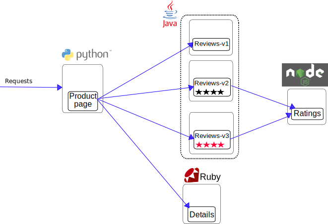

# 5. Implementing network policies

## Network Policies

A network policy is a specification of how groups of pods are allowed to communicate with each other and other network endpoints.

`NetworkPolicy` [resources](https://kubernetes.io/docs/reference/generated/kubernetes-api/v1.13/#networkpolicy-v1-networking-k8s-io) use `labels` to select pods and define rules which specify what traffic is allowed to the selected pods. Network policies are implemented by the network plugin, so you must be using a networking solution which supports `NetworkPolicy` - simply creating the resource without a controller to implement it will have no effect.

By default, pods are non-isolated, they accept traffic from any source.
Pods become isolated by having a `NetworkPolicy` that selects them. Once there is any `NetworkPolicy` in a `namespace` selecting a particular pod, that pod will reject any connections that are not allowed by any `NetworkPolicy`. Other pods in the namespace that are not selected by any `NetworkPolicy` will continue to accept all traffic.

## Network Policies in AKS

`NetworkPolicy` resource has been supported since old days of Kubernetes, and in v1.8 has been extended to control egress traffic of pods as well. It means you can install any network policy solution to your cluster e.g. Calico, Cilium, Azure NPM or even Istio regardless this is AKS, GKE or EKS.

For newly created clusters AKS comes with preview feature to simplify installation process: To create an AKS cluster that uses network policy, first enable a feature flag on your subscription. To register the `EnableNetworkPolicy` feature flag, use the az feature register command as shown in the following example:

```shell
az feature register --name EnableNetworkPolicy --namespace Microsoft.ContainerService
```

It takes a few minutes for the status to show Registered. You can check on the registration status by using the az feature list command:

```shell
az feature list -o table --query "[?contains(name, 'Microsoft.ContainerService/EnableNetworkPolicy')].{Name:name,State:properties.state}"
```

When ready, refresh the registration of the Microsoft.ContainerService resource provider by using the az provider register command:

```shell
az provider register --namespace Microsoft.ContainerService
```

After `Microsoft.ContainerService` completes registration you can create AKS cluster with additional `--network-policy` flag that currently accepts one of two values:
- `calico` to install [Calico v3.6](https://docs.projectcalico.org/v3.6/introduction/)
- `azure` to install [Azure NPM v1.13](https://github.com/Azure/azure-container-networking/releases/tag/v1.0.13).

```shell
az aks create \
    --resource-group $RESOURCE_GROUP_NAME \
    --name $CLUSTER_NAME \
    --network-policy calico \
    ...
```

## Implementing network policies

Staring point for this LAB is Azure CNI based AKS cluster created in previous lab. Since `--network-policy` canot be used to update cluster, we will manually install network policy plugin, latest release of Azure NPM (v1.18). Updated version is now able to properly support egress rules in contrast to v1.13 preinstalled by AKS.

### 1. Install [NPM DaemonSet](yaml/npm-daemonset.yaml) to your cluster.

``` shell  
kubectl apply -f npm-daemonset.yaml
```

After installation is completed note azure-npm pods running on each cluster node in kube-system namespace. Review npm-daemonset.yaml file and try to explain how network policies control traffic of pods.

### 2. Install [Kubernetes-nginx](yaml/nginx.yaml) ingress controller.

``` shell  
kubectl apply -f nginx.yaml
```

Installation should be fast in Kubernetes, but AKS will create new External LoadBalancer resource in Azure to make your cluster publicly accessible. This usually takes few minutes. You can wait for Public IP using `--watch` command switch.

``` shell  
kubectl get services -n default --watch
```

### 3. Install [Bookinfo](yaml/bookinfo.yaml) sample from Istio project.

Sample consists of Ingress resource that is attached to nginx ingress controller created in previous step and following set of services:



``` shell  
kubectl apply -f bookinfo.yaml
```

After resources are installed and pods are up and running you can browse solution using following URL: `http://<IP-address-of-ingress-controller>/productpage`. Note round robin routing to 3 versions of Reviews microservice (v2 and v3 uses Ratings service).

### 4. Applying NetworkPolicies 

First step when applying network policies is to deny all ingress traffic in your 'production' namespaces in AKS cluster. DO NOT apply network policies to `kube-system` namespace as this might lead to significant operational problems.

``` yaml  
apiVersion: networking.k8s.io/v1
kind: NetworkPolicy
metadata:
  name: default-all-deny
  namespace: default
spec:
  podSelector: 
    matchLabels: {}
  policyTypes:
  - Ingress
```

Apply [policy-all-deny.yaml](yaml/policy-all-deny.yaml) file and test if your service works as expected - please open new session in your broswer.

Try applying [other](yaml/policy-bookinfo.yaml) network policies one by one testing how they influence services communication in the cluster.

``` yaml
apiVersion: networking.k8s.io/v1
kind: NetworkPolicy
metadata:
  name: default-nginx-allow
  namespace: default
spec:
  podSelector:
    matchLabels:
      app.kubernetes.io/name: ingress-nginx
  policyTypes:
  - Ingress
  ingress:
  - {}

---

apiVersion: networking.k8s.io/v1
kind: NetworkPolicy
metadata:
  name: default-productpage-allow
  namespace: default
spec:
  podSelector:
    matchLabels:
      app: productpage
  policyTypes:
  - Ingress
  ingress:
  - ports:
    - port: 9080
    from: 
    - podSelector:
        matchLabels:
          app.kubernetes.io/name: ingress-nginx 

---

apiVersion: networking.k8s.io/v1
kind: NetworkPolicy
metadata:
  name: default-details-allow
  namespace: default
spec:
  podSelector:
    matchLabels:
      app: details
  policyTypes:
  - Ingress
  ingress:
  - ports:
    - port: 9080
    from:
    - podSelector:
        matchLabels:
          app: productpage 

---

apiVersion: networking.k8s.io/v1
kind: NetworkPolicy
metadata:
  name: default-reviews-allow
  namespace: default
spec:
  podSelector:
    matchLabels:
      app: reviews
  policyTypes:
  - Ingress
  ingress:
  - ports:
    - port: 9080
    from:
    - podSelector:
        matchLabels:
          app: productpage 

---

apiVersion: networking.k8s.io/v1
kind: NetworkPolicy
metadata:
  name: default-ratings-allow
  namespace: default
spec:
  podSelector:
    matchLabels:
      app: ratings
  policyTypes:
  - Ingress
  ingress:
  - ports:
    - port: 9080
    from:
    - podSelector:
        matchLabels:
          app: reviews 

```

### 5. Testing egress policies

Before you apply egress policies in the AKS cluster check if your pods have Internet connectivity.

Open shell of selected pod and try to curl/wget https://github.com url.

``` shell
kubectl exec -it <name-of-pod> -n default -- /bin/sh
wget https://github.com
exit
```
Apply modified version of deny policy 

```yaml  
apiVersion: networking.k8s.io/v1
kind: NetworkPolicy
metadata:
  name: default-all-deny
  namespace: default
spec:
  podSelector: 
    matchLabels: {}
  policyTypes:
  - Ingress
  - Egress
```

Repeat wget/curl steps and check again Internet connectivity of pod.

Did you notice all other services stopped working as well (Ingress)?
- `NetworkPolicy` resource in Kubernetes is LIFO ordered - policies are ewaluated top-to-bottom.
- Egress policy blocked DNS queries from pods.
- Egress policies blocked egress traffic of productpage to services, and traffic of review service to rating service.

### 6. Cleanup policies 

``` shell
kubectl delete -f policy-all-deny.yaml
kubectl delete -f policy-bookinfo.yaml
```

## Sources
- https://kubernetes.io/docs/concepts/services-networking/network-policies
- https://istio.io/docs/examples/bookinfo/
- https://docs.microsoft.com/en-us/azure/virtual-network/kubernetes-network-policies
