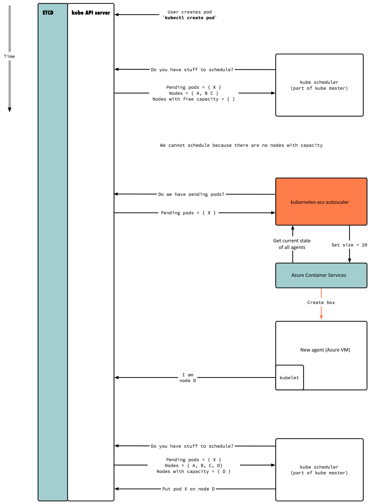

# 8. Limit resources for container and implement cluster autoscaler

## Limits - Resource types
CPU and memory are each a resource type. A resource type has a base unit. CPU is specified in units of cores, and memory is specified in units of bytes.

CPU and memory are collectively referred to as compute resources, or just resources. Compute resources are measurable quantities that can be requested, allocated, and consumed. They are distinct from API resources. API resources, such as Pods and Services are objects that can be read and modified through the Kubernetes API server.

Each Container of a Pod can specify one or more of the following:

- `spec.containers[].resources.limits.cpu`
- `spec.containers[].resources.limits.memory`
- `spec.containers[].resources.requests.cpu`
- `spec.containers[].resources.requests.memory`

### Meaning of CPU

Limits and requests for CPU resources are measured in cpu units. One cpu, in Kubernetes, is equivalent to 1 Azure vCore. Fractional requests are allowed. A Container with `spec.containers[].resources.requests.cpu` of **0.5** is guaranteed half as much CPU as one that asks for 1 CPU. The expression **0.1** is equivalent to the expression **100m**, which can be read as “one hundred millicpu”. Some people say “one hundred millicores”, and this is understood to mean the same thing. A request with a decimal point, like **0.1**, is converted to **100m** by the API, and precision finer than 1m is not allowed. For this reason, the form **100m** might be preferred.

CPU is always requested as an absolute quantity, never as a relative quantity; **0.1** is the same amount of CPU on a single-core, dual-core, or 48-core machine.

### Meaning of memory

Limits and requests for **memory** are measured in bytes. You can express memory as a plain integer or as a fixed-point integer using one of these suffixes: E, P, T, G, M, K. You can also use the power-of-two equivalents: Ei, Pi, Ti, Gi, Mi, Ki. For example, the following represent roughly the same value:

```
128974848, 129e6, 129M, 123Mi
```

Here’s an example. The following Pod has two Containers. Each Container has a request of 0.25 cpu and 64MiB (226 bytes) of memory. Each Container has a limit of 0.5 cpu and 128MiB of memory. You can say the Pod has a request of 0.5 cpu and 128 MiB of memory, and a limit of 1 cpu and 256MiB of memory.

```yaml
apiVersion: v1
kind: Pod
metadata:
  name: frontend
spec:
  containers:
  - name: db
    image: mysql
    env:
    - name: MYSQL_ROOT_PASSWORD
      value: "password"
    resources:
      requests:
        memory: "64Mi"
        cpu: "250m"
      limits:
        memory: "128Mi"
        cpu: "500m"
  - name: wp
    image: wordpress
    resources:
      requests:
        memory: "64Mi"
        cpu: "250m"
      limits:
        memory: "128Mi"
        cpu: "500m"
```

### How Pods with resource limits are run


- If a Container exceeds its memory limit, it might be terminated. If it is restartable, the kubelet will restart it, as with any other type of runtime failure.

- If a Container exceeds its memory request, it is likely that its Pod will be evicted whenever the node runs out of memory.

- A Container might or might not be allowed to exceed its CPU limit for extended periods of time. However, it will not be killed for excessive CPU usage.

### Quality of Service for Pods

When Kubernetes creates a Pod it assigns one of these QoS classes to the Pod:

- Guaranteed
- Burstable
- BestEffort

#### Guaranteed QoS class

For a Pod to be given a QoS class of Guaranteed:

- Every Container in the Pod must have a memory limit and a memory request, and they must be the same.
- Every Container in the Pod must have a CPU limit and a CPU request, and they must be the same.

#### Burstable QoS class

A Pod is given a QoS class of Burstable if:

- The Pod does not meet the criteria for QoS class Guaranteed.
- At least one Container in the Pod has a memory or CPU request.

#### BestEffort QoS class

For a Pod to be given a QoS class of BestEffort, the Containers in the Pod must not have any memory or CPU limits or requests.

## Limit resources for container on namespace

This lab creates namespaces that reflect a representative example of an organization's environments. In this case dev, uat and prod. We will also apply the appopriate permissions, limits and resource quotas to each of the namespaces.

1. Create three namespaces

    ```bash
    # Create namespaces
    kubectl apply -f create-namespaces.yaml

    # Look at namespaces
    kubectl get ns
    ```

2. Assign CPU, memory and storage limits to namespaces

    ```bash
    # Create namespace limits
    kubectl apply -f namespace-limitranges.yaml

    # Get list of namespaces and drill into one
    kubectl get ns
    kubectl describe ns uat
    ```

3. Assign CPU, Memory and Storage Quotas to Namespaces

    ```bash
    # Create namespace quotas
    kubectl apply -f namespace-quotas.yaml

    # Get list of namespaces and drill into one
    kubectl get ns
    kubectl describe ns dev
    ```

4. Test out Limits and Quotas in **dev** Namespace

    ```bash
    # Test Limits - Forbidden due to assignment of CPU too low
    kubectl run nginx-limittest --image=nginx --restart=Never --replicas=1 --port=80 --requests='cpu=100m,memory=256Mi' -n dev

    # Test Limits - Pass due to automatic assignment within limits via defaults
    kubectl run nginx-limittest --image=nginx --restart=Never --replicas=1 --port=80 -n dev
    
    # Check running pod and dev Namespace Allocations
    kubectl get po -n dev
    kubectl describe ns dev
    
    # Test Quotas - Forbidden due to memory quota exceeded
    kubectl run nginx-quotatest --image=nginx --restart=Never --replicas=1 --port=80 --requests='cpu=500m,memory=1Gi' -n dev
    
    # Test Quotas - Pass due to memory within quota
    kubectl run nginx-quotatest --image=nginx --restart=Never --replicas=1 --port=80 --requests='cpu=500m,memory=512Mi' -n dev
    
    # Check running pod and dev Namespace Allocations
    kubectl get po -n dev
    kubectl describe ns dev
    ```

5. Clean up limits, quotas, pods

    ```bash
    kubectl describe ns dev
    kubectl describe ns uat
    kubectl describe ns prod
    ```


## Implement cluster autoscaler

> Graphics by @wbuchwalter - [Kubernetes-acs-engine-autoscaler](https://github.com/wbuchwalter/Kubernetes-acs-engine-autoscaler)


**Deploy unschedulable pods - lack of system resources**

```bash
kubectl run nginx-scale --image=nginx --replicas=5 --port=80 --requests='cpu=500m,memory=4Gi'
```

**Check status of pods**

```bash
kubectl get pods
```

1. Create the service principal for DNS by AKS.

```bash
az ad sp create-for-rbac -n ClusterAutoscalerXY --skip-assignment
```

2. Assign the rights for the service principal.

```bash
az role assignment create --assignee http://ClusterAutoscalerXY --role contributor --resource-group aks02-xy

az role assignment create --assignee http://ClusterAutoscalerXY --role contributor --resource-group <mc-aks-resource-group>
```

### Deploy cluster autoscaler

1. Prepare cluster-autoscaler.yaml (Secret/cluster-autoscaler-azure). For base64 you can use [base64encode](https://www.base64encode.org/) or in bash -> `echo -n <content> | base64`

```yaml
apiVersion: v1
kind: Secret
metadata:
  name: cluster-autoscaler-azure
  namespace: kube-system
data:
  ClientID: <base64-encoded-client-id>
  ClientSecret: <base64-encoded-client-secret>
  ResourceGroup: <base64-encoded-resource-group>
  SubscriptionID: <base64-encode-subscription-id>
  TenantID: <base64-encoded-tenant-id>
  VMType: QUtT
  ClusterName: <base64-encoded-aks-name>
  NodeResourceGroup: <base64-encoded-mc-aks-resource-group>
```

2. Deploy cluster-autoscaler.yaml.

```bash
kubectl apply -f cluster-autoscaler.yaml
```

3. Check cluster-autoscaler logs

```bash
kubectl get pods -n kube-system
kubectl logs -f -n kube-system <cluster-autoscaler-pod-name>
```

4. Delete nginx-scale deployment

```bash
kubectl delete deployments nginx-scale
```

5. Check cluster-autoscaler logs

```bash
kubectl get pods -n kube-system
kubectl logs -f -n kube-system <cluster-autoscaler-pod-name>
```
